# lab4_sec
# Lab 2 — Analyse Statique d'APK

## Informations générales

| Champ | Valeur |
|-------|--------|
| APK analysé | app-debug.apk |
| Package | com.example.pizzarecipes |
| Version | 1.0 (versionCode=1) |
| Provenance | Généré depuis Android Studio |
| Hash SHA-256 | 3B08349E30616758A4D8ACCF680A203A218DA5FCD82229BE00DBAD173458F762 |
| Outils utilisés | JADX GUI v1.5.5, dex2jar v2.4, JD-GUI v1.6.6 |

---

## Démarche suivie

### Task 1 & 2 — Préparation du workspace et obtention de l'APK

L'APK a été généré depuis Android Studio via `Build > Build APK(s)`.  
Il a été localisé dans `app/build/outputs/apk/debug/app-debug.apk` puis copié dans le dossier de travail `C:\Users\WINDOWS 11\Desktop\apk4`.

**Capture 1 — APK généré dans Android Studio**  
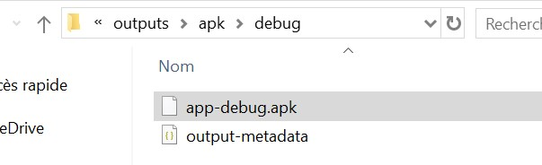

Le hash SHA-256 a été calculé via PowerShell pour assurer la traçabilité :

```powershell
Get-FileHash -Algorithm SHA256 "C:\Users\WINDOWS 11\Desktop\apk4\app-debug.apk"
```

**Capture 2 — Hash SHA-256**  
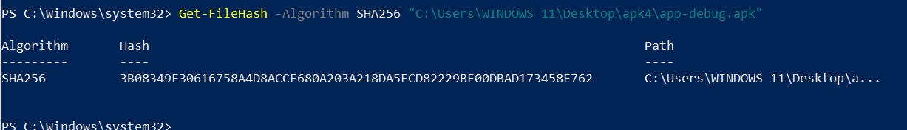

Le contenu de l'APK a été listé pour vérifier sa structure interne :

**Capture 3 — Contenu de l'APK**  
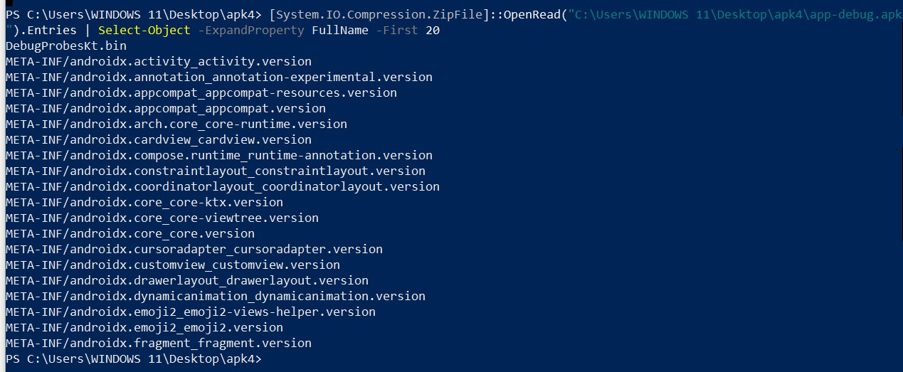

---

### Task 3 — Analyse avec JADX GUI

L'APK a été ouvert dans JADX GUI. L'arborescence montre la structure complète : code source, ressources, AndroidManifest.xml, et 8 fichiers DEX (multi-dex).

**Capture 4 — JADX GUI : arborescence de l'APK**  
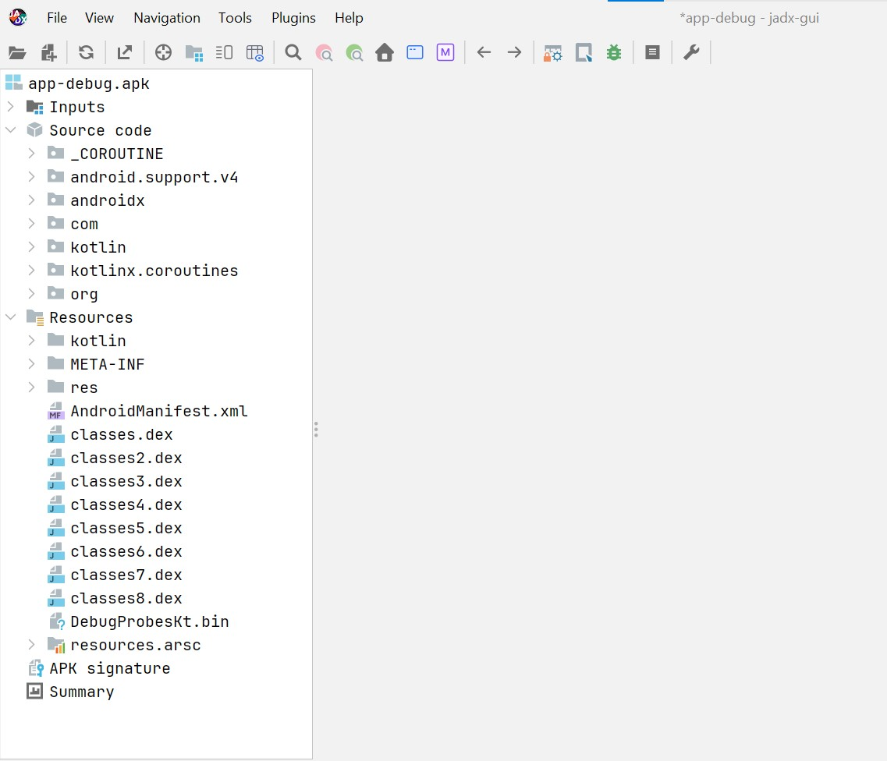

#### Analyse du AndroidManifest.xml

Points identifiés dans le manifeste :

- **Package** : `com.example.pizzarecipes`
- **versionCode** : 1 | **versionName** : 1.0
- **minSdkVersion** : 24 | **targetSdkVersion** : 36
- **android:debuggable="true"** → ⚠️ Mode debug activé
- **android:allowBackup="true"** → ⚠️ Sauvegarde ADB autorisée
- **SplashActivity** exportée avec `android:exported="true"` et intent-filter MAIN/LAUNCHER
- **Permission** : `com.example.pizzarecipes.DYNAMIC_RECEIVER_NOT_EXPORTED_PERMISSION`

**Capture 5 — AndroidManifest.xml dans JADX**  
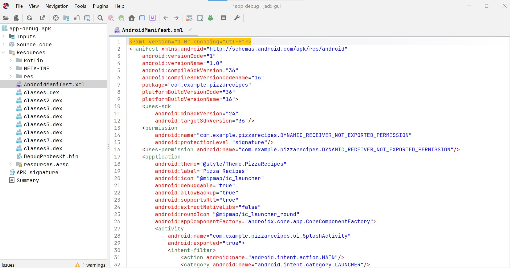

#### Exploration des ressources — strings.xml

Le fichier `strings.xml` contient les chaînes de l'application dont `app_name = "PizzaRecipes"`. Aucune donnée sensible (token, mot de passe, clé API) n'a été trouvée dans ce fichier.

**Capture 6 — strings.xml dans JADX**  
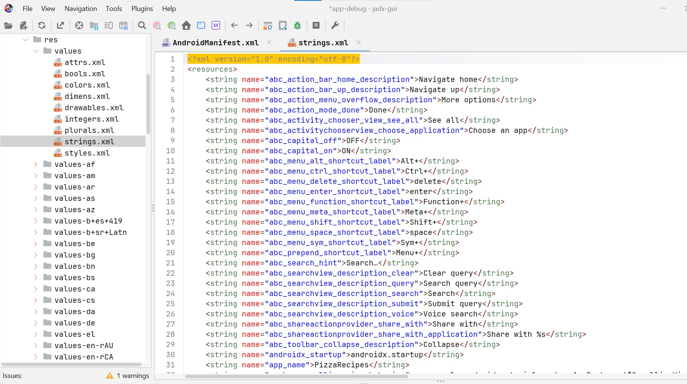

#### Code source décompilé — MainActivity

La `MainActivity` se trouve dans `com.example.pizzarecipes.ui`. JADX indique qu'elle est chargée depuis `classes3.dex`. Le code est lisible et non obfusqué.

**Capture 7 — MainActivity dans JADX**  
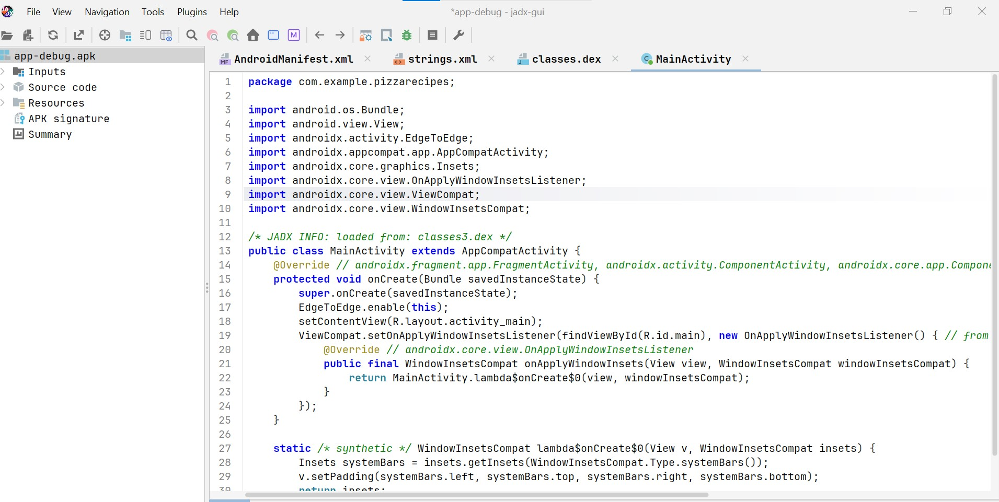

---

### Task 4 — Recherche de chaînes sensibles

Une recherche globale a été effectuée sur le mot-clé `http` dans JADX GUI (`Ctrl+Shift+F`).

**Résultats :** Les occurrences trouvées correspondent uniquement à des namespaces Android internes (`http://schemas.android.com/apk/res/android`) et à des classes de bibliothèques (AndroidX, Material). Aucune URL externe codée en dur ni endpoint API n'a été détecté dans le code applicatif.

**Capture 8 — Recherche "http" dans JADX**  
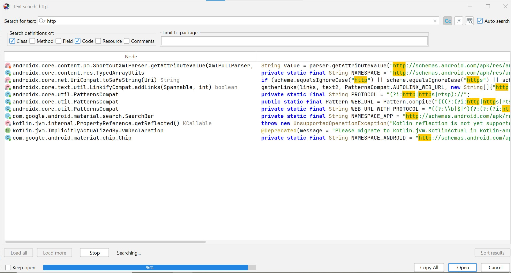

| Terme recherché | Résultat | Niveau de risque |
|----------------|----------|-----------------|
| `http` | Namespaces Android internes uniquement | Faible |
| `password` | Aucun résultat | Faible |
| `secret` | Aucun résultat | Faible |
| `api_key` | Aucun résultat | Faible |
| `DEBUG` | Mode debug activé dans le manifeste | Élevé (si production) |

---

### Task 5 — Conversion DEX → JAR avec dex2jar

Les fichiers DEX ont été extraits de l'APK via PowerShell. L'APK contient **8 fichiers DEX** (multi-dex).

```powershell
mkdir "C:\Users\WINDOWS 11\Desktop\apk4\dex_out"
# Extraction des fichiers DEX
[System.IO.Compression.ZipFile]::OpenRead("...app-debug.apk").Entries | 
  Where-Object { $_.Name -like "classes*.dex" } | ForEach-Object { ... }
```

**Capture 9 — Extraction des fichiers DEX**  
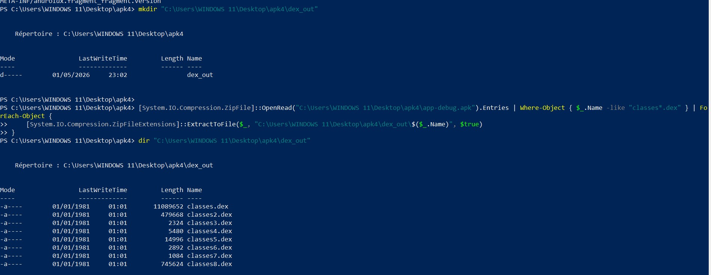

Le fichier `classes.dex` a ensuite été converti en `app.jar` avec dex2jar v2.4 :

```powershell
cd "C:\outils-lab2\dex2jar"
.\d2j-dex2jar.bat "...\dex_out\classes.dex" -o "...\app.jar"
```

Le fichier `app.jar` généré fait **8 340 816 octets** (~8 MB).

**Capture 10 — Conversion dex2jar réussie**  
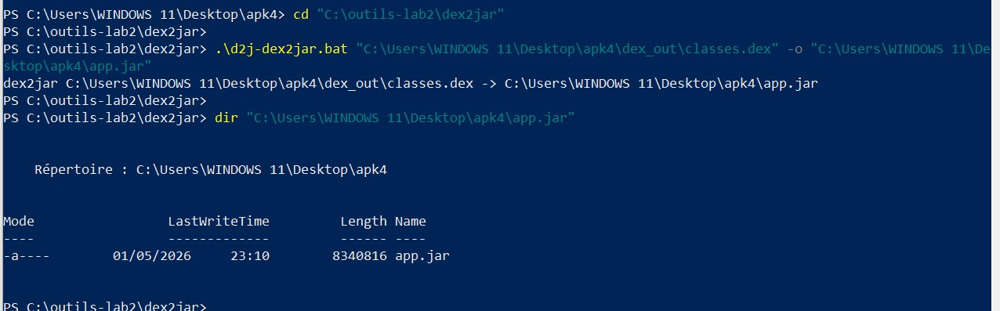

---

### Task 6 — Comparaison JADX GUI vs JD-GUI

Le fichier `app.jar` a été ouvert dans JD-GUI. L'arborescence affiche uniquement le bytecode Java (packages : `_COROUTINE`, `android.support.v4`, `androidx`, `com.google`, `kotlin`, `kotlinx.coroutines`), sans accès aux ressources Android.

**Capture 11 — JD-GUI : arborescence de app.jar**  
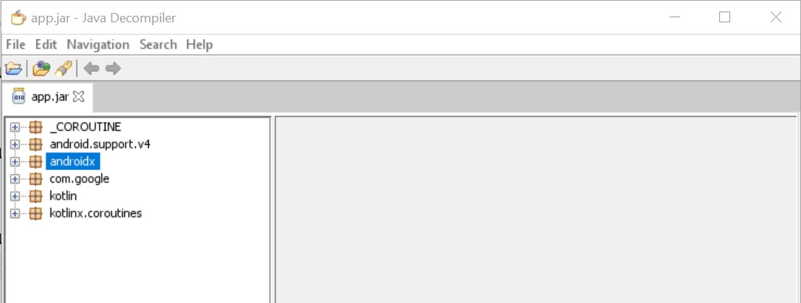

La `MainActivity` a été comparée dans les deux outils (trouvée dans `app3.jar` côté JD-GUI, correspondant à `classes3.dex`) :

**Capture 12 — Comparaison JADX vs JD-GUI sur MainActivity**  
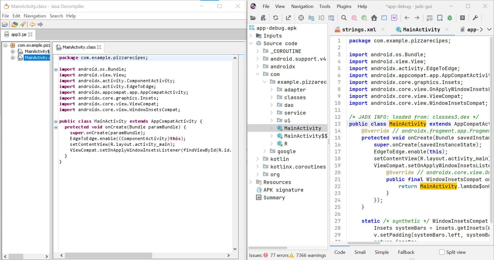

| Aspect | JADX GUI | JD-GUI |
|--------|----------|--------|
| Ressources Android | Accès direct (Manifest, XML, assets) | Non disponible |
| Résolution des ID | Noms lisibles (`R.id.xxx`) | Constantes numériques brutes |
| Lisibilité du code | Excellente, commentaires automatiques | Plus brut, moins annoté |
| Navigation | Arborescence Android complète | Arborescence Java uniquement |
| Multi-DEX | Gestion transparente | Nécessite d'ouvrir chaque JAR séparément |

**Conclusion :** JADX GUI est l'outil principal recommandé pour l'audit Android car il offre une vue complète (code + ressources + manifeste). JD-GUI reste utile comme outil de validation secondaire.

---

## Constats de sécurité

### Constat #1 : Mode débogage activé (`android:debuggable="true"`)
**Sévérité :** 🔴 Élevée (en contexte de production)  
**Description :** L'attribut `android:debuggable="true"` est présent dans le manifeste. Normal pour un build debug, critique si déployé tel quel.  
**Localisation :** `AndroidManifest.xml` — attribut de la balise `<application>`  
**Impact potentiel :** Permet l'attachement d'un débogueur distant, l'inspection mémoire et l'extraction de données sensibles à l'exécution.  
**Remédiation :** Utiliser uniquement des builds `release` pour la distribution. Android Studio supprime automatiquement cet attribut dans les builds de production.

---

### Constat #2 : Sauvegarde ADB autorisée (`android:allowBackup="true"`)
**Sévérité :** 🟡 Moyenne  
**Description :** L'attribut `android:allowBackup="true"` permet l'extraction des données privées de l'application via `adb backup` sans nécessiter d'accès root.  
**Localisation :** `AndroidManifest.xml` — attribut de la balise `<application>`  
**Impact potentiel :** Un attaquant ayant un accès USB au téléphone peut extraire les SharedPreferences, bases de données locales et fichiers internes.  
**Remédiation :** Passer à `android:allowBackup="false"` dans le manifeste.

---

### Constat #3 : Composant exporté (SplashActivity)
**Sévérité :** 🟢 Faible  
**Description :** La `SplashActivity` est exportée avec `android:exported="true"` et un intent-filter MAIN/LAUNCHER. C'est intentionnel pour le lancement de l'app mais constitue une surface d'attaque.  
**Localisation :** `AndroidManifest.xml` — balise `<activity android:name="com.example.pizzarecipes.ui.SplashActivity">`  
**Impact potentiel :** D'autres applications peuvent démarrer cette activité. Pour une app de recettes, le risque est limité.  
**Remédiation :** Vérifier que toutes les activités secondaires ont `android:exported="false"`. L'activité principale doit rester exportée pour le launcher.

---

## Annexes

### Permissions demandées
- `com.example.pizzarecipes.DYNAMIC_RECEIVER_NOT_EXPORTED_PERMISSION` (permission interne, protectionLevel=signature)

> Aucune permission dangereuse (caméra, microphone, localisation, contacts) n'est demandée — ce qui est cohérent avec une application de recettes de cuisine.

### Composants exportés
- `com.example.pizzarecipes.ui.SplashActivity` — exporté via intent-filter MAIN/LAUNCHER

### Fichiers DEX identifiés
| Fichier | Taille |
|---------|--------|
| classes.dex | 11 089 652 octets |
| classes2.dex | 479 668 octets |
| classes3.dex | 2 324 octets (contient MainActivity) |
| classes4.dex | 5 480 octets |
| classes5.dex | 14 996 octets |
| classes6.dex | 2 892 octets |
| classes7.dex | 1 084 octets |
| classes8.dex | 745 624 octets |

---

## Conclusion

Cette analyse statique de l'APK `app-debug.apk` (PizzaRecipes) a permis d'identifier **3 points de sécurité**. L'application ne contient aucun secret codé en dur, aucune URL externe exposée, et aucune permission dangereuse — ce qui représente un niveau de risque global **faible à moyen**.

Les deux points prioritaires à corriger avant tout déploiement en production sont la désactivation du mode debug et la configuration de la politique de sauvegarde.
